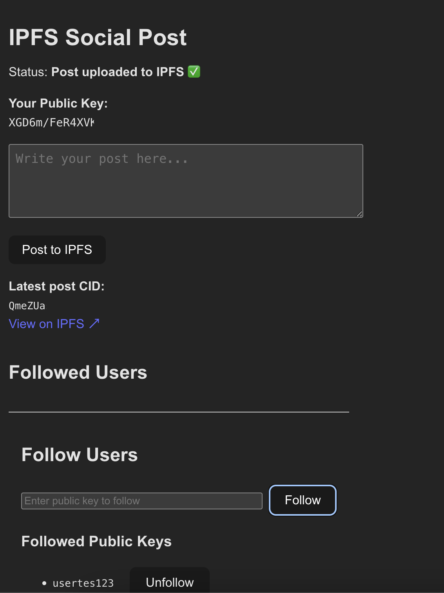
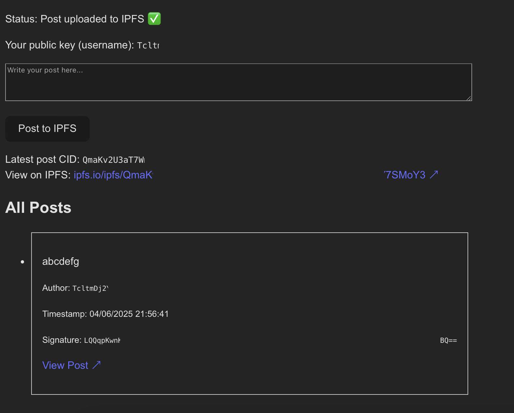

# Decentralized Social App on IPFS

A decentralized social media prototype built on IPFS, leveraging public/private key identity for user authentication and signed posts. Users can post short messages, follow others by their public keys, and fetch posts from followed users—all data stored and retrieved via IPFS.

---

## Features

* **User Identity**: Generates public/private key pairs (using tweetnacl) stored locally for signing posts. Public key serves as username.
* **Create Posts**: Users can write posts (like tweets), which include timestamp and author public key, signed with private key.
* **Upload to IPFS**: Posts are serialized as JSON, signed, and uploaded to IPFS. The post’s CID is stored locally.
* **Follow Users**: Manually add other users by entering their public keys. Followed users’ keys are saved in `localStorage`.
* **Fetch Feed**: For each followed user, fetch known post CIDs (stored locally) and retrieve posts from IPFS. Display combined timeline sorted by timestamp.
* **LocalStorage Persistence**: User identity, followed users, and known post CIDs persist in browser `localStorage`.

---

## Tech Stack

* React (with hooks)
* IPFS HTTP Client (`ipfs-http-client`)
* `tweetnacl` for key generation and signing
* LocalStorage for persistence

---

## Installation & Running

1. Clone the repo:

   ```bash
   git clone <repo-url>
   cd decentralized-social
   ```

2. Install dependencies:

   ```bash
   npm install
   ```

3. Make sure you have a local IPFS node running with the HTTP API available (default at `http://127.0.0.1:5001/api/v0`).

4. Start the React app:

   ```bash
   npm start
   ```

5. Open your browser to [http://localhost:3000](http://localhost:3000).

---

## Project Structure

* `src/App.jsx`: Main component managing IPFS connection, posting, and rendering posts.
* `src/Identity.js`: Handles public/private key pair generation, signing, and encoding.
* `src/FollowUsers.jsx`: Component to add and list followed public keys, persisted in `localStorage`.
* `src/useFeed.js`: Custom hook managing followed users, their post CIDs, and fetching posts from IPFS.
* `src/ipfsUtils.js`: Helper functions for fetching and decoding JSON posts from IPFS by CID.

---

## Usage

* On load, the app generates (or loads) your key pair and shows your public key as your username.
* Write a short post and click **Post to IPFS** to upload and sign it.
* Use the **Follow Users** section to add other users' public keys.
* The feed will display posts from you and followed users, fetched from IPFS.
* All keys, posts, follows, and CIDs are saved locally.

---

## Notes & Future Improvements

* Currently, the app stores known post CIDs in `localStorage` per followed user. There's no global registry or discovery mechanism.
* Following users is manual by entering their public keys.
* Consider adding a “CID registry” backend (e.g., GitHub Gist) for better post discovery.
* Add cryptographic verification of signatures on fetched posts.
* Improve UI/UX and error handling.
* Support user profiles and richer posts.

---

### Main Feed and Posting Interface




---

## License

MIT License

